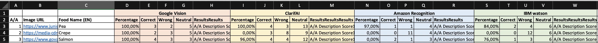

## Short dataset for the evaluation of the deep learning platforms

The images of this dataset are collected with the Selenium image crawler.

### Prediction results from the deep learning platforms
The [food_detection.xlsx ](food_detectionV2.xlsx ) file contain the entire dataset and the output of the web-platform, which combines the capabilities of the four different deep learning platforms.

- The **1st sheet of the excel file** contains the data of the first round of the experiment. 120 uniqe images.
- The **2nd sheet of the excel file** contains the data of the Second round of the experiment. 120 uniqe images.

**File description:**
- **Image URL:** image location in the web.
- **Food Name (EN):** the food name (label) searched in the results of the engines.
- **Deep learning Platform Name:** Google Vision, ClarifAI, Amazon Recoknition, IBM Watson. 5 sub items for each platform:
  - **Percentage:** The prediction of the platform based on the label (**Food Name (EN)**)
  - **Correct:** Number of the correct predicted ingredients in the food image.
  - **Wrong:** Number of the wrong predicted items (elements) in the food image
  - **Neutral:** Number of the corrected predicted items (elements) in the food image, but not related to the food, for example: dish, spoon, table etc.
  - **Results:** The full outcomes of the predictions of the platforms.
  
